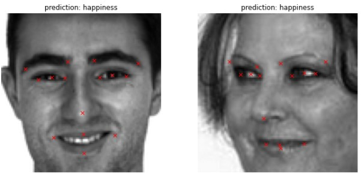
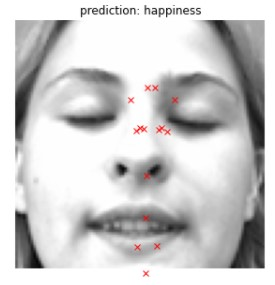
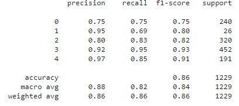

# Emotion_classification_and_face_keypoints_prediction_with_ResNet_model
Use ResNet architecture to predict emotion and keypoints from face images

This project comes from [UDEMY's course on modern AI applications](https://www.udemy.com/course/modern-artificial-intelligence-applications).
The objective is to use a ResNet architecture to built two deep learning models from scratch:
- one model will predict keypoints on images of human faces
- one model will predict the emotion from the image out of 5 classes {0:'anger', 1:'disgust', 2:'sad', 3:'happiness', 4: 'surprise'}

Combining both models, the project generates detailed emotion predictions for new unseen images.

# Dataset

The project uses two sets of images, one set of over 20,000 images labeled with the facial emotion and one set of over 2,000 images labeled with 15 facial keypoints (x and y coordinates) and face emotion.
Each dataset is used to train the respective model on its assigned task.
The datasets are available on kaggle [here: Facial Expression Recognition](https://www.kaggle.com/c/challenges-in-representation-learning-facial-expression-recognition-challenge/data) and [here: Facial Keypoints Detection](https://www.kaggle.com/c/facial-keypoints-detection/data).

# Part 1: key facial points detection

This part is achieved using a deep learning model with convolution neural network and resnet architecture. The model will predict x and y coordinates of 15 key facial points from grayscale 96x96 images.

The dataset used for training of the model contains 2,140 images with x and y coordinates of 15 keypoints and associated emotion.
We proceed with data augmentation in order to increase the number of training samples.
- horizontal flip
- brightness increase
as well as data normalization (pixel values between 0 and 1). We end up with 3 x times more samples.

Facial keypoint detection model:

- RESNET principles

- The model use two Res-blocks able to resolve vanishing gradient issues in deep models thanks to identity blocks passing along the input signal down to deeper layers. The signal is progressively downsampled through Average Pooling layers. In the last section of the model, a dense neural network generates 30 coordinates corresponding to the x's and y's of the 15 keypoints. This is achieved with a final layer of output dimension 30 and ReLu activation (positive numbers from zero to infinity).

The model contains over 18 millions parameters to train. Adam optimizer and MSE loss metric (regression task) are used.

# Part 2: Facial expression detection

In this part, a deep learning model with convolution neural network and resnet architecture analyzes images and predicts emotion from facial expression on grayscale 96x96 images.

The dataset used for training of the model contains 24,568 images with associated facial emotion.
The classe 1 ('disgust') is well under-represented and will be penalized during training. To overcome this issue, we could perform data augmentation equalizing the distribution (not done in this project). Instead, we proceed with real-time data augmentation using ImageDataGenerator. The objective is to increase the number of samples as we perform training.
This approach allows to illustrate the issue generated by an unbalanced dataset.

The RESNET model for this task uses two res_block and a final dense layer of dimension 5 with softmax activation to generate the prediction over the 5 possible classes. The predicted class is selected by looking at the highest probability within the softmax distribution.

Training is performed using adam optimizer and categorical_crossentropy loss metric (multi-label classification task).
Unlike the key facial points detection model, a large number of epochs (> 200) should be considered to achieve acceptable performance.

# Part 3: Combine models

In this last step, we combine the two models in a pipeline taking images as input and predicting the facial keypoints and facial emotion.

Key points detection performance is fairly precise. Below an exemple of wrong keypoint predictions which may be explained by the unusual face with closed eyes. The model is unable to find the contrasted round pattern of the eyes likely to be critical to place keypoints and fails to properly detect key points.

Emotion prediction performance is also fairly good with the exception of classe #1 (disgust) due to its limited representation in the dataset. The model had too little samples compared to the other classes to properly isolate the specific features allowing to differentiate to the other classes.

