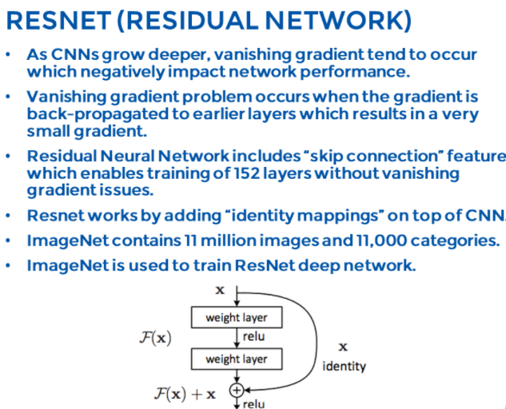
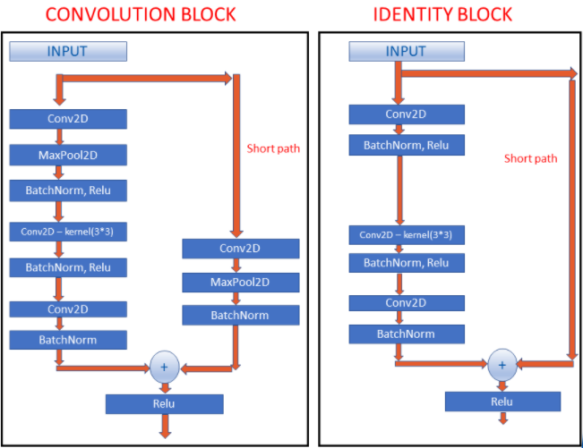

# Emotion_classification_and_face_keypoints_prediction_with_ResNet_model
Use ResNet architecture to predict emotion and keypoints from face images

This project comes from [UDEMY's course on modern AI applications](https://www.udemy.com/course/modern-artificial-intelligence-applications).
The objective is to use a ResNet architecture to built two deep learning models from scratch:
- one model will predict keypoints on images of human faces
- one model will predict the emotion from the image out of 5 classes {0:'anger', 1:'disgust', 2:'sad', 3:'happiness', 4: 'surprise'}
Through the combination of both models, the project generates detailed emotion predictions for new unseen images.

# Dataset

The project uses two sets of images, one set of over 20,000 images labeled with the emotion and one set of over 2,0000 images labeled with 15 keypoints (x and y coordinates) and the face emotion.
Each dataset is used to train the respective model on its targeted task.
The datasets are available on kaggle [here: Facial Expression Recognition](https://www.kaggle.com/c/challenges-in-representation-learning-facial-expression-recognition-challenge/data) and [here: Facial Keypoints Detection](https://www.kaggle.com/c/facial-keypoints-detection/data).

# Part 1: key facial points detection

This part is achieved using a deep learning model with convolution neural network and resnet architecture. The model will predict x and y coordinates of 15 key facial points from grayscale 96x96 images.

The dataset used for training of the model contains 2,140 images with x and y coordinates of 15 keypoints and associated emotion.
We proceed with data augmentation in order to increase the number of training samples.
- horizontal flip
- brightness increase
as well as data normalization (pixel values between 0 and 1). We end up with 3 x times more samples.

Facial keypoint detection model:

- RESNET principles

- The model use two Res-blocks able to resolve vanishing gradient issues in deep models with identity blocks passing along the input signal down to deeper layers. The signal is progressively downsampled through Average Pooling layers. In last section of the model, a dense neural network generates 30 coordinates corresponding to the x's and y's of the 15 keypoints. This is achieved with a final layer of output dimension 30 and ReLu activation.

The model contains over 18 millions parameters to train.

# Part 2: Facial expression detection

In this part, a deep learning model with convolution neural network and resnet architecture analyzes images and predicts emotion fromfacial expression dection in grayscale 96x96 images.

